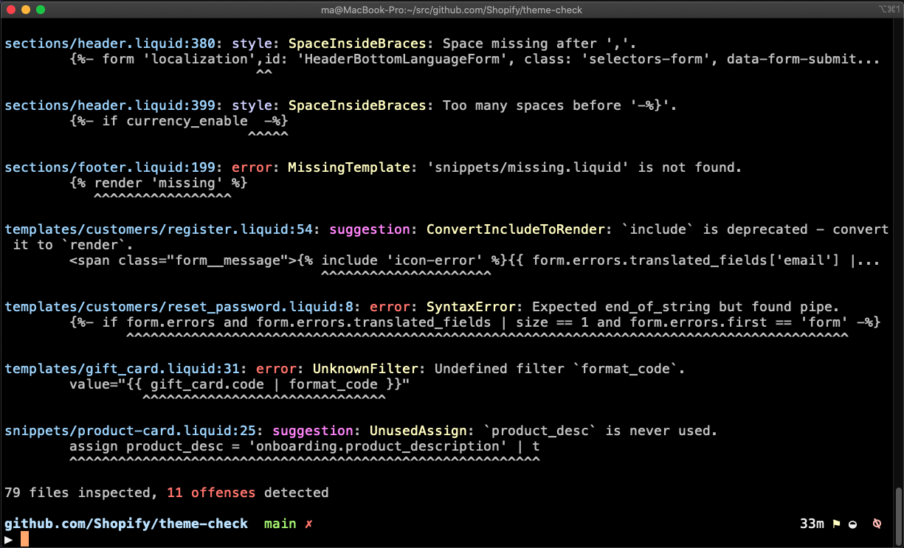

# platformOS Check ✅ - A Linter for platformOS

PlatformOS Check is a tool that checks your app’s Liquid code to make sure it follows the recommended best practices for [platformOS](https://www.platformos.com/).
This tool looks for common errors and areas where your code could be improved, helping you clean up and optimize your code by pointing out syntax mistakes, outdated elements, and performance issues.



## Supported Checks

PlatformOS Check currently performs the following checks:

**Syntax Validation:**

✅ Liquid syntax errors  
✅ JSON syntax errors  

**Resource Verification:**

✅ Missing partials and GraphQL files  
✅ Unused variables (using ``,  and similar tags)  
✅ Unused partials  

**Code Efficiency and Quality:**

✅ Template length  
✅ Deprecated tags  
✅ Unknown tags  
✅ Unknown filters  
✅ Missing or extra spaces inside `` and `{{ ... }}`  
✅ Using several `` instead of ``  
✅ Undefined objects  
✅ Deprecated filters  
✅ Missing `platformos-check-enable` comment  
✅ Invalid arguments in `` tags  
✅ Missing `authenticity_token` in `<form>`  
✅ Unreachable code

**Performance Optimization:**

✅ Preventing the [use of GraphQL queries inside loops](/docs/checks/graphql_in_for_loop.md)  
✅ Identifying [parser-blocking JavaScript](/docs/checks/parser_blocking_javascript.md)
✅ Ensuring `img` tags have [width and height attributes to improve loading times](/docs/checks/img_width_and_height.md)

For detailed descriptions and configuration options, [take a look at the complete list of checks](/docs/checks/).

We continually update and expand our checks. If you have suggestions, please [let us know by creating an issue](https://github.com/Platform-OS/platformos-lsp/issues).

## Installation

- Download and install the extension [more]
- Next steps:
  -> [using-local-ruby]
  -> [docker]

### Using Locally Installed Ruby

#### Requirements

- Ruby 3.2+

### Install Ruby and platform-check gem

⚠️ **Note:** Please make sure you install Ruby and the gem for your user and not as root to avoid permission issues. Install without using `sudo`.

1. Download and install Ruby version 3.2 or higher using the [Official Ruby documentation](https://www.ruby-lang.org/en/documentation/installation/).

Ensure your Ruby is 3.2 or higher: 

  ruby -v

⚠️ **Note:** Restart your terminal after installation.

2. Install platformos-check gem, using:

  gem install platformos-check

Confirm the installation was successful by checking the version:

  platformos-check --version

If you chose this method, use `platformos-check-language-server` as a path to your language server instead of `/Users/<username/platformos-check-language-server`.

### Using Docker

To set up the PlatformOS Check Language Server using Docker, follow these steps:

#### platformOS Check Language Server

1. Create a file named `platformos-check-language-server` and ensure it's executable and placed within a directory listed in your $PATH variable.

2. Use the following script:

```bash
DIR=$(pwd)
IMAGE_NAME=platformos/platformos-lsp:latest

LOG_DIR=$DIR/logs
mkdir $LOG_DIR 2>/dev/null
LOG_FILE=$LOG_DIR/platformos-lsp.log

exec docker run -i \
  -v $DIR:$DIR \
  -w $DIR \
  -e PLATFORMOS_CHECK_DEBUG=true \
  -e PLATFORMOS_CHECK_DEBUG_LOG_FILE=$LOG_FILE \
   $IMAGE_NAME $@
```

This script downloads the latest Docker image and starts the language server. Visual Studio Code (VS Code) can manage this process automatically, but you can also run the script manually for verification if needed.

#### Troubleshooting

- If the `onlySingleFileChecks: true` setting does not work as expected, check your Visual Studio Code (VS Code) workspace settings. Ensure that the workspace contains only a single project.

#### PlatformOS Check as a Standalone Function

PlatformOS Check can also be used as a standalone function.

1. Prepare and run the following script to set up the Docker environment:

```bash
DIR=$(pwd)
IMAGE_NAME=platformos/platformos-check:latest

LOG_DIR=$DIR/logs
mkdir $LOG_DIR 2>/dev/null
LOG_FILE=$LOG_DIR/platformos-check.log

exec docker run -i \
  -v $DIR:$DIR \
  -w $DIR \
  -e PLATFORMOS_CHECK_DEBUG=true \
  -e PLATFORMOS_CHECK_DEBUG_LOG_FILE=$LOG_FILE \
   $IMAGE_NAME $@
```

2. To check if the tool is correctly installed up, run:

  platformos-check --help`

**Usage example for CI/CD:**

  platformos-check --fail-level error

This setting ensures that the CI process will fail if any errors are detected during the checks.

## Configuration

To configure PlatformOS Check according to your project's needs, you create a `.platformos-check.yml` file in the root directory of your application.

See [config/default.yml](config/default.yml) for available options and their default values.

## Disable Checks with Comments

Control the behavior of PlatformOS Check within your Liquid templates using comments to disable and re-enable checks as needed.

### Temporarily Disabling All Checks

```liquid



```

All checks will be ignored between the `disable` and `enable` comments.

### Disabling a Specific Check

To disable a specific check, such as `UnusedAssign`, include the check's name in the comment:

```liquid



```

### Disabling Multiple Checks

To disable multiple checks simultaneously, list them in a comma-separated format within the comments:

```liquid



```

### Disabling Checks for the Entire Document

To disable a check throughout the entire document, place the disabling comment in the first line:

```liquid


```

## Exit Code and `--fail-level`

Configure the exit code of platformos-check using the `--fail-level` (default: `error`) flag, which is especially useful in continuous integration (CI) scenarios. This flag helps you control at what severity level checks should cause your CI process to fail.

### Usage Examples

```
# Make CI fail on styles warnings, suggestions, and errors
platformos-check --fail-level style path_to_app

# Make CI fail on suggestions, and errors
platformos-check --fail-level suggestion path_to_app

# Make CI fail on errors
platformos-check path_to_app
```

### Fail Levels

There are three fail levels:

- `error`
- `suggestion`
- `style`

### Exit Code Meanings

- 0: Success — no issues found.
- 1: Your code does not pass the specified fail level of checks.
- 2: Error in platformos-check itself — indicates a bug within the tool.

### Customizing Check Severity

You can adjust the severity of specific checks using the `severity` attribute in your configuration file:

```yaml
DeprecateLazysizes:
  enabled: true
  severity: error
```

This configuration, for example, treats the "DeprecateLazysizes" check as an error, thus influencing the exit code according to the `--fail-level` set.

## Language Server Configurations

Configure the PlatformOS Check language server to optimize how it interacts with your files in the development environment. The following settings can be adjusted in your editor's configuration file. 

In VS Code, you can set it directly in your `settings.json` file.

- `platformosCheck.checkOnOpen` (default: `true`): Automatically runs checks when a file is opened.
- `platformosCheck.checkOnChange` (default: `true`): Executes checks whenever changes are made to a file.
- `platformosCheck.checkOnSave` (default: `true`): Initiates checks every time a file is saved.
- `platformosCheck.onlySingleFileChecks` (default: `false`): Limits checks to the currently opened file, excluding checks that involve the entire application such as 'UnusedPartial' or 'TranslationKeyExists'.

⚠️ **Note:** Quickfixes only work on files that have been recently checked. If you have disabled the automatic checking configurations, you need to manually rerun platformos-check to enable quickfixes.

## Contributing

We welcome contributions from the community! For detailed guidance on how to contribute, please refer to our [contribution guidelines](/CONTRIBUTING.md). Your input helps us make the tool better for everyone.
