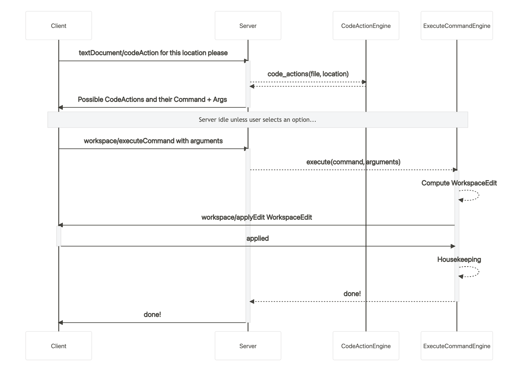
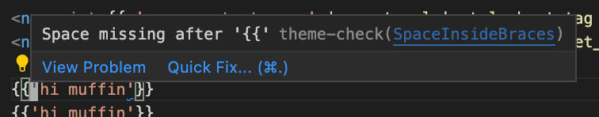
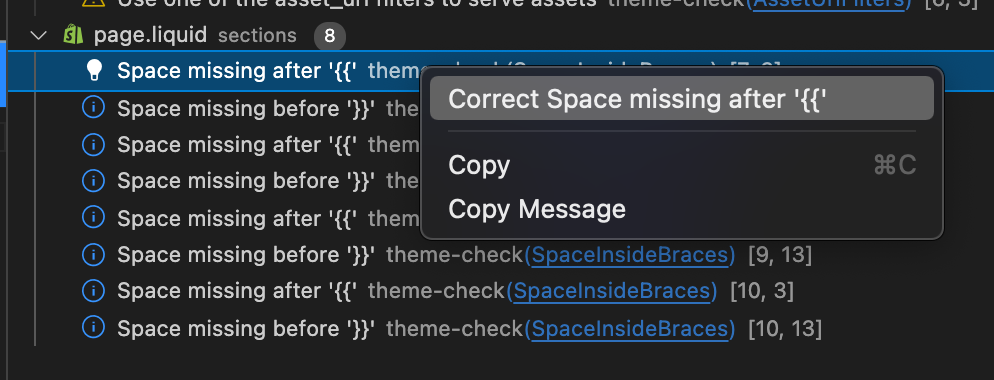
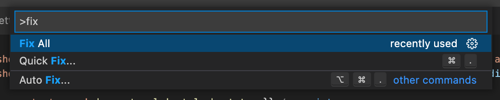
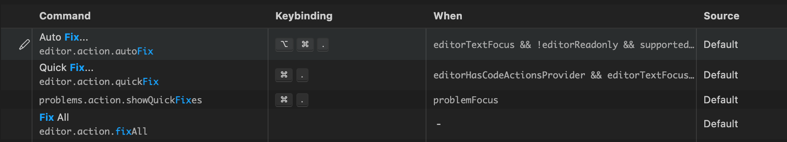

# How to Correct Code with Code Actions, Commands, and Workspace Edits

The [Language Server Protocol (LSP)][lsp] empowers Language Server developers to provide tools like refactorings, quick fixes, and command executions to their users. PlatformOS Check utilizes this protocol to offer quick fixes and auto-correction capabilities to users.

## Overview

The process of correcting code using platformOS Check:

1. **Request Code Actions**: The Client (e.g., VS Code, vim) requests [Code Actions](#code-actions) from the Server based on the user's current cursor position or selection. The server returns actions categorized as `quickfix` or `source.fixAll`, which are available for the given text location.
2. **User Selection**: The user selects a desired code action from the UI (see [visual examples](#code-actions)). This selection asks the Client to send a `correction` request to the Server to execute a specific action based on the identified [Diagnostics](#diagnostic).
3. **Apply Edits**: The Server calculates the necessary changes and requests the Client to apply a [Workspace Edit](#workspace-edits) which adjusts the code to resolve the issues.

## Sequence Diagram



<details>
<summary>Sequence Diagram Explanation</summary>

1. **Request Code Actions**: The Client requests [code actions](#code-actions) from the Server, specifying the file and the exact location (character range) within it.
2. **Server Response**: The Server responds with available code actions for that location, such as `quickfix` and `source.fixAll`.
3. **Awaiting User Input**: The system pauses while waiting for the user to select a desired code action.
4. **User Selection**: The User chooses a code action from the provided options.
5. **Execute Command**: Following the selection, the Client requests the Server to execute the chosen code action by sending a `workspace/executeCommand`.
6. **Calculate Edits**: The Server calculates the necessary changes, or [workspace edits](#workspace-edits), required to implement the command.
7. **Apply Edits**: The Server requests the Client to apply these edits through a `workspace/applyEdit` command, which adjusts the file to resolve the issues.
8. **Client Confirmation**: The Client confirms whether the edits were successfully applied (`applyEdit`).
9. **Diagnostics Update**: The Server updates its internal diagnostics based on the changes and informs the Client of the latest diagnostic state.
10. **Complete Execution**: The Server finalizes the process by responding to the `workspace/executeCommand` request, confirming the completion of the action.

</details>

## Code Action and Command Handling

platformOS Check handles two types of Client-to-Server LSP requests:

1. **Code Actions**: On `textDocument/codeAction`, our `CodeActionEngine` returns the results obtained from all `CodeActionProvider`.
2. **Execute Commands**: On `workspace/executeCommand`, our `ExecuteCommandEngine` dispatches the command and arguments to appropriate `ExecuteCommandProvider`.

### Providers Defined:

- **CodeAction Providers**
  1. [`QuickFixCodeActionProvider`](/lib/platformos_check/language_server/code_action_providers/quickfix_code_action_provider.rb) - Provides code actions that fix _one_ diagnostic.
  2. [`SourceFixAllCodeActionProvider`](/lib/platformos_check/language_server/code_action_providers/source_fix_all_code_action_provider.rb) - Provides code actions that fix _all_ diagnostics in the current file.
- **ExecuteCommand Provider**:
  1. [`CorrectionExecuteCommandProvider`](/lib/platformos_check/language_server/execute_command_providers/correction_execute_command_provider.rb) - Takes a list of diagnostics as arguments, turns them into a [WorkspaceEdit](#workspace-edit) and requests the Client to apply them (`workspace/applyEdit`).

### Additional Details

We define a [`DocumentChangeCorrector`](/lib/platformos_check/language_server/document_change_corrector.rb) (an LSP analog to our [`Corrector`](/lib/platformos_check/corrector.rb) class). This class turns corrector calls into document changes supported by the LSP. For more details, refer to the [LSP reference on resource changes][lspresourcechange].

## Definitions and Examples

### Code Actions

A [CodeAction][lspcodeaction] is a suggestion for a change to the code that the User can apply directly. It could include refactorings, fixes for linting errors, or test executions.

The Client determines which actions it can perform by sending a `textDocument/codeAction` request from the client to the server.

<details>
<summary>Visual Examples</summary>

In VS Code, different types of code actions are represented and accessed differently within the user interface:

- **`Quick Fix...` button**: Appears when you hover over a diagnostic marker.

  

- **Right-click on a diagnostic in the problems tab**:

  

- **Command palette entries for `Quick Fix...` and `Fix All`**:

  

- **Keyboard shortcuts**:

  
</details>

<details>
  <summary>TypeScript Interface</summary>

  ```ts
  interface CodeAction {
    title: string; // Human-readable display name of the action, shown in the UI.
    kind?: CodeActionKind; // OPTIONAL, used to filter actions based on type.
    diagnostics?: Diagnostic[]; // List of diagnostics that the action SOLVES.
    isPreferred?: boolean; // Are used by auto fix and can be targetted by keybindings.
    // Shown as faded out in the code action menu when the user request a more specific type of code action.
    disabled?: {
      reason: string;
    },

    // If both an edit and a command are present, the edit is applied first, followed by the command.
    // Generally, the edit is intended to be executed by the client to make changes to the document,
    // while the command is executed by the server to perform additional actions.
    edit?: WorkspaceEdit; // Describes the document changes to be made by the action.
    command?: Command; // The command to be executed by the server.
    data?: any; // Additional data sent from the CodeAction to the codeAction/resolve.
  }

  interface Command {
    title: string; // Display name of the command, like 'Save'.
    command: string; // ID of the command.
    arguments?: any[] // Optional arguments for the command.
  }
  ```
</details>

---

### Commands

A [Command][lspcommand] in the Language Server Protocol (LSP) is a representation of a function that can be executed by the server, based on instructions sent from the client.

Think of commands as actionable requests - similar to function calls — that the client can initiate. These commands are often linked to a Code Action. When a client initiates a specific Code Action, it sends a `workspace/executeCommand` request from the client to the server.

<details>
  <summary>TypeScript Interface</summary>

  ```ts
  interface Command {
    title: string; // Display name of the command, like 'Save'.
    command: string; // ID of the command.
    arguments?: any[] // Optional arguments for the command.
  }
  ```
</details>

---

### Workspace Edits

A [WorkspaceEdit][lspworkspaceedit] is a Language Server Protocol (LSP) construct designed to represent code changes in a structured data format. This approach allows operations like editing, creating, or deleting files to be described as data transactions.

<details>
  <summary>TypeScript Interface</summary>

  ```ts
  interface WorkspaceEdit {
    changes?: { uri: TextEdit[] ];
    documentChanges: (TextDocumentEdit | CreateFile | RenameFile | DeleteFile|)[];
    changeAnnotations?: { [id: string]: ChangeAnnotation }
  }

  // See https://microsoft.github.io/language-server-protocol/specifications/specification-current/#resourceChanges.
  interface CreateFile {
    kind: 'create';
    uri: DocumentUri;
    options?: CreateFileOptions;
    annotationId?: ChangeAnnotationIdentifier;
  }

  interface TextEdit {
    range: Range;
    newText: string; // The new text to replace the specified range. An empty string indicates deletion.
  }

  interface TextDocumentEdit {
    textDocument: OptionalVersionedTextDocumentIdentifier;
    edits: (TextEdit | AnnotatedTextEdit)[]
  }

  interface OptionalVersionedTextDocumentIdentifier {
    uri: TextDocumentURI;
    // null is for when the file wasn't open from the client.
    // integer is for when you know what it was.
    version: integer | null;
  }
  ```
</details>

---

### Diagnostic

A [Diagnostic][lspdiagnostic] is a construct within the Language Server Protocol (LSP) used to represent issues within the code, such as errors, warnings, and informational messages.

In platformOS Check, diagnostics highlight ode offenses that need addressing, such as errors or warnings. They are shown in the _Problems_ tab and next to the code in the editor's gutter, helping developers quickly locate and understand the issues detected by the system.

[lsp]: https://microsoft.github.io/language-server-protocol/specification
[lspcodeaction]: https://microsoft.github.io/language-server-protocol/specification#textDocument_codeAction
[lspcommand]: https://microsoft.github.io/language-server-protocol/specification#command
[lspexecutecommand]: https://microsoft.github.io/language-server-protocol/specification#workspace_executeCommand
[lspworkspaceedit]: https://microsoft.github.io/language-server-protocol/specification#workspaceEdit
[lspdiagnostic]: https://microsoft.github.io/language-server-protocol/specifications/lsp/3.17/specification/#diagnostic
[lspresourcechange]: https://microsoft.github.io/language-server-protocol/specifications/specification-current/#resourceChanges
